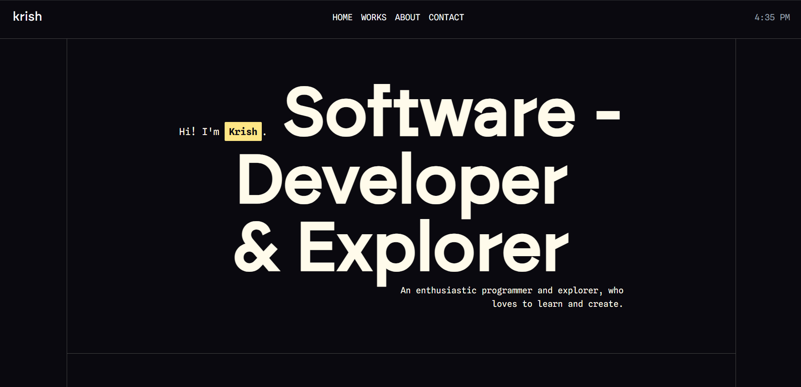

# Krish - Portfolio

A modern, animated, and fully responsive developer portfolio built with React, TypeScript, GSAP, Lenis, and Vite.
Showcasing my work, skills, GitHub activity, and interactive UI concepts with smooth transitions and immersive design.

## ✨ Features

### 🎨 Beautiful Motion & Interactions

- Smooth scrolling powered by **Lenis**
- Elegant animations using **GSAP**
- Mouse-follow effects and micro-interactions
- Section-based entrance transitions

### 💼 Project Showcases

- Detailed cards with hover animations
- Live links + GitHub links
- Responsive layout

### 📱 Fully Responsive

- Perfectly designed for desktops, tablets, and mobiles

---

## 🛠️ Built With

| Technology             | Purpose                         |
| ---------------------- | ------------------------------- |
| **React + TypeScript** | Core framework                  |
| **Vite**               | Fast bundling & dev environment |
| **GSAP**               | Page + scroll animations        |
| **Lenis**              | Smooth scrolling engine         |
| **Tailwind CSS**       | Styling & layout                |
| **Vercel**             | Deployment                      |

---

## 📁 Project Structure

```
portfolio/
├── src/
│   ├── components/   # Reusable UI components
│   ├── sections/     # Home, About, Projects, Contact
│   └── main.tsx      # App entry
├── public/
└── vite.config.ts
```

---

## 🌟 Screenshots

|  |
| -------------------- |

---

## 📬 Author

[Krish](https://github.com/ikrishagrawal)
