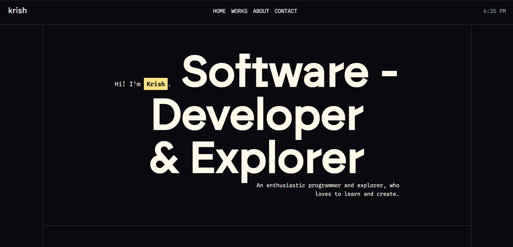

# Krish - Portfolio

A modern, animated, and fully responsive developer portfolio built with Astro, TypeScript, GSAP, Lenis, and Tailwind.
Showcasing my work, skills, blogs, and interactive UI concepts with smooth transitions and immersive design.

## Features

### Beautiful Motion & Interactions

- Smooth scrolling powered by **Lenis**
- Elegant animations using **GSAP**
- Mouse-follow effects and micro-interactions
- Section-based entrance transitions

### Project Showcases

- Detailed cards with hover animations
- Live links + GitHub links
- Responsive layout

### Blogs Section

- Obsidian based CMS for blogs
- Styled and rendered markdown

### Fully Responsive

- Perfectly designed for desktops, tablets, and mobiles

## Built With

| Technology             | Purpose                  |
| ---------------------- | ------------------------ |
| **Astro + TypeScript** | Core framework           |
| **GSAP**               | Page + scroll animations |
| **Lenis**              | Smooth scrolling engine  |
| **Tailwind CSS**       | Styling & layout         |
| **Vercel**             | Deployment               |

## Screenshots

|  |
| -------------------- |

---

## 📬 Author

[Krish](https://github.com/ikrishagrawal)
